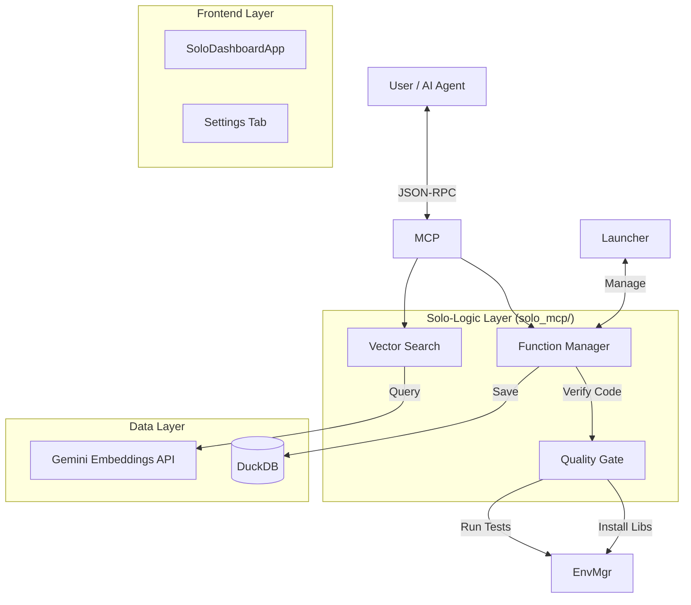

# Solo-MCP - System Design Document (Ver 2.5)

## 1. プロダクトコンセプト (Concept)

### 1.1 目的：車輪の再開発の完全撤廃
AIエージェントによるプログラミングにおける「同じようなロジックを何度もゼロから書き直す」無駄を、個人開発資産（Solo Assets）として管理することで解消する。

### 1.2 コアバリュー：Solo Developerのための「外部海馬」
コードを単なるテキストではなく、**「Solo-MCP」** が保証する「動作検証済みのスキル（Ability）」として永続化する。
AIエージェントにとっての **「信頼できる長期記憶領域（External Hippocampus）」** および **「標準作業手順書（SOP Library）」** を提供する。

---

## 2. システムアーキテクチャ (Architecture)

**Local-First / Standalone Architecture**
外部クラウドに依存せず、ユーザーのPC内で完結する構成。

---

## 3. 品質保証ロジック (The Quality Gate 2.0)

本システムの肝である **「バックグラウンドでの徹底的な品質チェック」** のフロー定義。
`save_function` 実行時、以下の **"Three Guardians"** パイプラインを通過したコードのみが `verified` ステータスとして保存される。

### 3.1 Guardian 1: The Linter (Ruff)
コードの整形と基本的なバグを排除する。
*   **実装**: `uv run ruff check --select E,F,W,I` をサブプロセスで実行。
*   **基準**:
    *   エラー (E, F) が1つでもあれば **Reject**。
    *   Warning (W) は自動修正 (fix) を試みる。
*   **目的**: PEP8準拠とインポート順の整理を強制。

### 3.2 Guardian 2: The Typer (Mypy)
型安全性を保証する。AIエージェントにとって「型情報」は命綱。
*   **実装**: `uv run mypy --ignore-missing-imports`。
*   **基準**:
    *   関数シグネチャ (`def func(a: int) -> str:`) の型ヒントを推奨。
    *   致命的な型エラーがあれば **Reject**。
*   **目的**: エージェントがコードを解析・利用する際の予測可能性を向上。

### 3.3 Guardian 3: The Critic (Gemini LLM)
人間（またはAI）にとっての「分かりやすさ」を判定する。
*   **実装**: Gemini API (`gemma-3-27b-it` デフォルト) を使用し、コードを3つの観点で採点 (0-100)。
    1.  **Readability (可読性)**: 変数名は適切か？ロジックは素直か？
    2.  **Docstring (文書化)**: エージェントがツールとして使うための説明が十分か？
    3.  **Reusability (再利用性)**: 特定の環境やパスに依存しすぎていないか？
*   **基準**: 総合スコア **80点以上** で合格。
*   **目的**: **「動くゴミ」** の量産を防ぎ、厳選された高品質なスキルのみを資産化。

### 3.4 依存関係の解決 (Dependency Resolution)
「環境が違うから動かない」を撲滅する。
*   **ハッシュベース管理**: 依存ライブラリリスト（例: `['numpy', 'pandas']`）をソートしてハッシュ化。
*   **環境プーリング**: 同一構成の仮想環境 (`.mcp_envs/{hash}`) が存在すれば再利用。なければ `uv` で新規作成。
*   **タイムアウト設定**: インストール処理は **300秒 (5分)**。

### 3.5 動的テスト実行 (Dynamic Testing)
AIが提供した `test_cases` を実際に実行し、論理的整合性を保証する。
*   **隔離実行**: 作成された仮想環境の Python バイナリを使用し、サブプロセス (`subprocess.run`) で実行。
*   **タイムアウト設定**: **30秒**。無限ループによるリソース枯渇を防止。
*   **結果フィードバック**: 失敗時は `Traceback` を含む詳細なエラーログをAIに返し、自律的な修正を促す。

---

## 4. 機能要件 (Functional Requirements)

### 4.1 MCPツール (AI Agent Interface)
| ツール名 | 目的 | 入力 | 挙動概要 |
|:---|:---|:---|:---|
| **`save_function`** | **資産化** | `name`, `code`, `dependencies`, `test_cases` 等 | 品質ゲートを通過させ、結果（成功/失敗ログ）を返す。 **実行用ではない**ことをAIに明示。 |
| **`search_functions`** | **再利用** | `query` (自然言語) | ベクトル検索により、意図に合致する関数を検索する。 「車輪の再開発禁止」をAIに指示。 |
| **`get_function`** | **統合** | `name` | 関数のソースコード全文を返す。 AIはこのコードを自身のコンテキストに展開して使用する。 |

### 4.2 ダッシュボード (User Interface)
| 機能 | 詳細 |
|:---|:---|
| **Server Control** | サーバープロセスの起動・停止・ステータス監視。 |
| **Function Explorer** | 保存済み関数のリスト表示、詳細確認、削除機能。DuckDB直接参照。 |
| **Settings** | Embeddingモデル (`gemini-embedding-001`) やQuality Gateモデルの選択、APIキー設定。 |

---

## 5. データモデル (Database Schema)

DuckDBを使用し、メタデータとベクトルを効率的に管理する。

### Table: `functions`
| カラム名 | 型 | 説明 |
|:---|:---|:---|
| `id` | INTEGER | 主キー (Sequence) |
| `name` | VARCHAR | 関数名 (Unique) |
| `code` | VARCHAR | Pythonソースコード |
| `description` | VARCHAR | 自然言語による説明 |
| `tags` | VARCHAR | タグリスト (JSON) |
| `metadata` | VARCHAR | 依存関係、検証日時、エラーログ等 (JSON) |
| `status` | VARCHAR | `'active'` (検証済), `'broken'` (失敗) |
| `test_cases` | VARCHAR | テストケースリスト (JSON) |
| `version` | VARCHAR | バージョン番号 |
| `created_at` | VARCHAR | 作成日時 |
| `updated_at` | VARCHAR | 更新日時 |

### Table: `embeddings`
| カラム名 | 型 | 説明 |
|:---|:---|:---|
| `function_id` | INTEGER | FK -> functions.id |
| `vector` | FLOAT[] | 可変次元ベクトル (デフォルト: 3072次元) |
| `model_name` | VARCHAR | 埋め込み生成に使用したモデル名 (例: `gemini-embedding-001`) |

---

## 6. 非機能要件 (Non-Functional Requirements)

*   **Robustness (堅牢性):**
    *   ログ出力は `stderr` に限定し、MCPの `stdout` 通信を阻害しない。
    *   `uv` のインストールエラー、実行タイムアウト、構文エラーを明確に区別してハンドリングする。
*   **Performance (性能):**
    *   Gemini APIを使用することでローカルGPU/CPU負荷を排除し、安定した埋め込み生成を実現。
    *   2回目以降の実行は環境キャッシュにより **1秒以内** の検証完了を目指す。
*   **Usability (使いやすさ):**
    *   `FunctionStore.bat` という単一のエントリーポイント。
    *   黒い画面（コンソール）を見せない GUI ランチャー。
    *   BYOK (Bring Your Own Key) モデル。`GOOGLE_API_KEY` の設定が必要。
