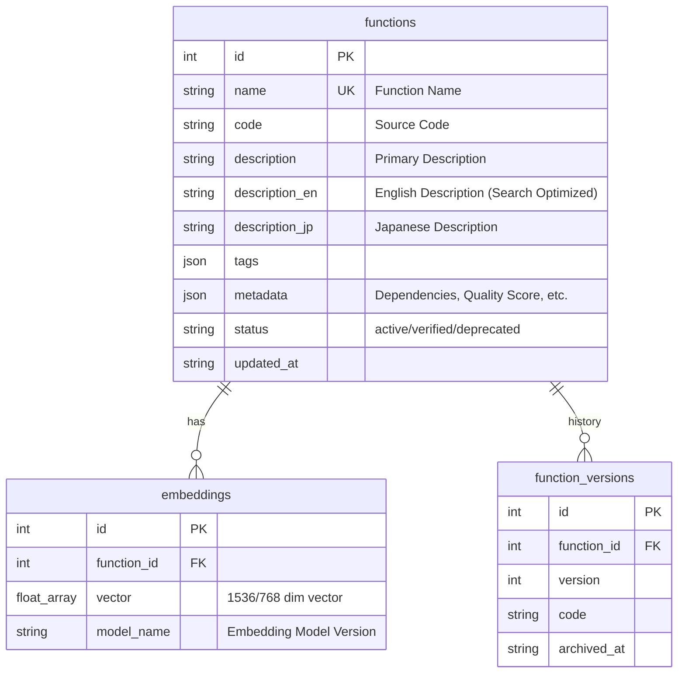
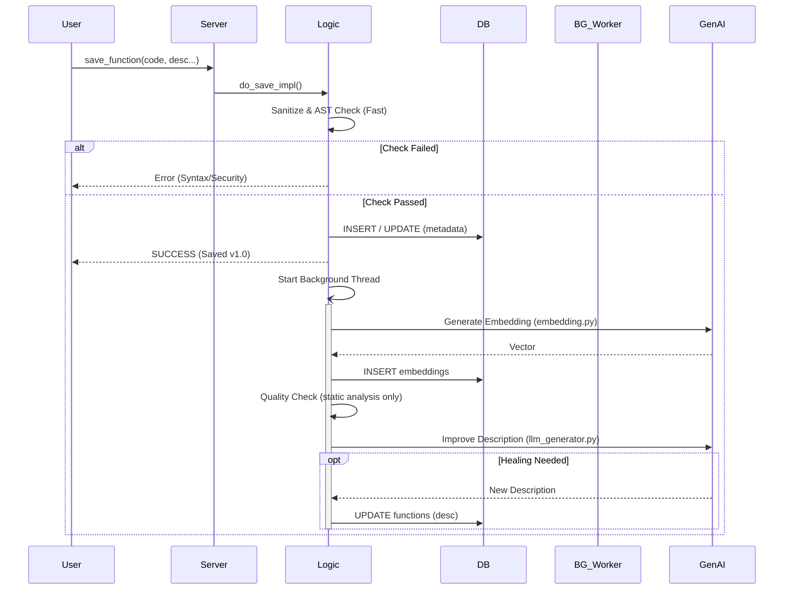
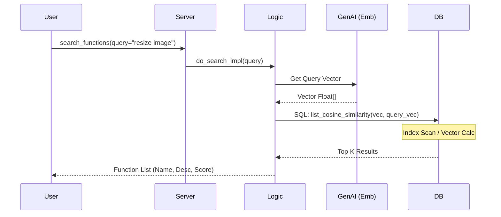

# Function Store MCP (Core Edition) システム詳細設計書

**作成者**: ホリエモン (AI Persona)
**最終更新日**: 2026-02-19
**バージョン**: 1.1.0 (DevTools Reformation)

---
## 0.設計方針（優先度）
同じ関数の再開発によるリソースの無駄をなくすこと。
その価値を提供するためにはある程度の保存されている関数の品質が高いことが望ましいが絶対条件ではない。下書きを提供する機能が優先。その次のその下書きの品質を上げること。

### 1位
FuncstionStoreから適切な下書きを提供する機能
### 2位
依存関係への対策（※MVPでは「関数単体で完結」させる運用を優先し、複雑な依存解決ライブラリの再発明を避ける）
### 3位
下書きの品質の向上

## 1. システム概要

### 1.1 目的
本システム「Function Store MCP」は、AIエージェント（Cursor, Claude, Gemini CLI等）が生成したPython関数コードを「再利用可能な資産」として蓄積・検索・活用するためのローカル・ミドルウェアである。
「コードを書き捨てない」「車輪の再発明を防ぐ」ことを主眼とし、高品質な関数ライブラリを自律的に構築する基盤を提供する。

### 1.2 デザインフィロソフィ（Horiemon's View）
*   **Local First**: 外部SaaS依存を最小限にし、ローカル（DuckDB）で完結させる。速いし安いし安全。
*   **Quality Over Quantity**: ゴミコードをただ溜め込んでも検索ノイズになるだけ。Quality Gate（Lint/TypeCheck）で「使える」ものだけを通す。
*   **Invisible UX**: ユーザーは「保存」「検索」のアクションをするだけ。Embdedding生成や品質チェック、自動修復（Auto-Heal）はバックグラウンドで勝手にやる。

---

## 2. アーキテクチャ

システムは **FastMCP** をインターフェースとし、**DuckDB** を永続化層とするレイヤードアーキテクチャを採用している。

### 2.1 技術スタック
*   **Language**: Python 3.10+
*   **Interface**: FastMCP (MCP Protocol Implementation)
*   **Database**: DuckDB (Structured Data + Vector Search)
*   **Embedding**: Google Gemini-Embedding-001 (Google GenAI SDK)
*   **Quality Gate**:
    *   Linter: Ruff
    *   Type Checker: Mypy
    *   Formatter: Black
*   **LLM Generator**:
    *   Reviewer/Desc Generator: Google Gemini (google-genai SDK)
*   **Frontend**: Flet (Dashboard UI)
*   **Package Manager**: uv

### 2.2 全体構成図

```mermaid
graph TD
    User[AI Agent / User] <-->|MCP Protocol (Stdio/SSE)| MCPServer[MCP Server (server.py)]
    User <-->|HTTP| Dashboard[Flet Dashboard]
    
    subgraph "MCP Core Root"
        Root[main.py / FunctionStore.bat]
    end

    subgraph "MCP Core Packages (backend/mcp_core/)"
        subgraph "api"
            Api[api.py (FastAPI)]
        end
        subgraph "engine"
            Logic[logic.py (Core Logic)]
            QGate[quality_gate.py]
            Sanitizer[sanitizer.py]
            EmbService[embedding.py]
        end
        subgraph "core"
            Security[security.py]
            DBAdapter[database.py]
            Config[config.py]
        end
        subgraph "runtime"
            Env[environment.py (uv/venv)]
            Runtime[runtime.py]
        end
    end
    
    MCPServer --> Logic
    Dashboard --> Api
    Api --> Logic
    
    Logic --> Sanitizer
    Logic --> Security
    Logic --> QGate
    Logic --> DBAdapter
    
    QGate -.->|Reference| Linter[Ruff]
    QGate -.->|Reference| Mypy[Mypy]
    
    Logic -.->|Background Thread| BG_Job[Background Handler]
    BG_Job --> EmbService
    EmbService -.->|API Call| GenAI[Google GenAI]
```

### 2.3 ディレクトリ構造 (New)
*   `backend/mcp_core/api/`: API層。FastAPI、認証(`verify_api_key`)。
*   `backend/mcp_core/engine/`: エンジン層。ロジック、品質チェック、埋め込み、サニタイズ。
*   `backend/mcp_core/core/`: 基盤層。DB接続、共通設定、ASTベースのセキュリティチェック。
*   `backend/mcp_core/runtime/`: 実行層。関数ごとの仮想環境(uv)管理、コード実行。

---

## 3. コンポーネント詳細

### 3.1 統合エントリポイント (`main.py`)
システム全体の統合ランチャー。
*   `--dashboard`: Flet UIを起動（デフォルト）。
*   `--server`: FastMCPサーバーを起動。
*   `FunctionStore.bat`: Windows環境用のダブルクリック起動用ランチャー。

### 3.2 Server Layer (`backend/mcp_core/server.py`)
MCPプロトコルへの準拠を担当。 FastMCPを使用して各レイヤーを統合。

### 3.3 Engine Layer (`backend/mcp_core/engine/`)
ビジネスロジックの中核。
*   **Logic (`logic.py`)**: `do_save_impl`, `do_search_impl` 等のコアロジック。保存は同期、Embedding/品質チェックは非同期。
*   **Quality Gate (`quality_gate.py`)**: 静的解析（Ruff, Mypy, Black）による品質検証。

### 3.4 Core Layer (`backend/mcp_core/core/`)
*   **Database (`database.py`)**: DuckDBへの接続管理。
*   **Security (`security.py`)**: ASTベースの安全検証。

### 3.5 API Layer (`backend/mcp_core/api/`)
*   **API (`api.py`)**: FastAPIによるREST API。Dashboard等の外部ツール用。

### 3.6 Developer Tools (`dev_tools/`) (New)
Horiemon's Critiqueにより刷新された、開発者自身の生産性を最大化するためのツール群。
*   **`dev.py`**: 統合開発ランチャー。`uv run` をラップし、Lint/Format/Test を一括実行する。
*   **`tests/`**: ユニットテスト・E2Eテスト。
*   **Note**: `cicd/` ディレクトリは "Simple is Best" の原則に基づき削除された。

### 3.7 Quality Gate Optimization
`QualityGate` エンジンは、ディスクI/Oを排除するために **Standard Input (stdin)** ストリーム処理に最適化されている。
Ruff などの高速ツールをメモリ上でパイプライン実行することで、検証オーバーヘッドを極小化している。

---

## 4. データモデル (DuckDB Schema)

### 4.1 ER図



### 4.2 主要テーブル定義

1.  **`functions`**: 現在の関数データ。
    *   `status`: `active` (通常), `verified` (テスト通過), `pending` (チェック中)。
2.  **`embeddings`**: 検索用ベクトル。
    *   `functions` とは 1:N (理論上) だが、現状は 1:1 で運用。
    *   モデル更新時 (`gemini-embedding-001` -> `004` 等) に再計算・更新される。
3.  **`config`**: KVS形式の設定保存（DB migration管理用など）。

---

## 5. 主要プロセスのシーケンス

### 5.1 関数保存プロセス (Fast Return Pattern)

ユーザービリティを損なわないよう、重い処理を非同期化しているのが特徴。



### 5.2 関数検索プロセス



---

## 6. 今後の拡張性・改善点 (Horiemon's View)

1.  **サポート言語の限定と検証**:
    *   現状、メタデータ管理と静的解析（Ruff等）の恩恵を最大化するため、サポート対象を **Python (.py)** および **JavaScript (.js)** に限定している。
2.  **Object-Oriented Programming (OOP) の強化**:
    *   単体関数だけでなく、Pythonクラス（`class`）の保存・検索・品質チェックを正式サポートする。クラスメソッド内のコード品質も `quality_gate.py` で検証可能であることを担保する。
3.  **Flet DashboardのWebアプリ化**:
    *   現状はローカルアプリだが、FastAPI + React/Vue にして、チーム内共有サーバーとして動かせるようにすべき。Solo-MCPからTeam-MCPへの進化。
4.  **Dependency Management Strategy (Self-contained Policy)**:
    *   関数間の依存関係（AがBを呼ぶ等）は、システムが自動解決するのではなく、**「統合された自己完結型(Integrated Version)」として1つの資産にまとめて保存する**ことをMVPの基本原則とする。
    *   これにより、資産のポータビリティを最大化し、AIエージェントが取得したコードを即座に利用可能にする。
5.  **Vector Storeの汎用化**:
    *   現状はDuckDB固定だが、pgvector (Supabase) への同期機能強化により、ローカルで開発→クラウドで全社共有のパイプラインを太くする。

---
*End of Design Document*
