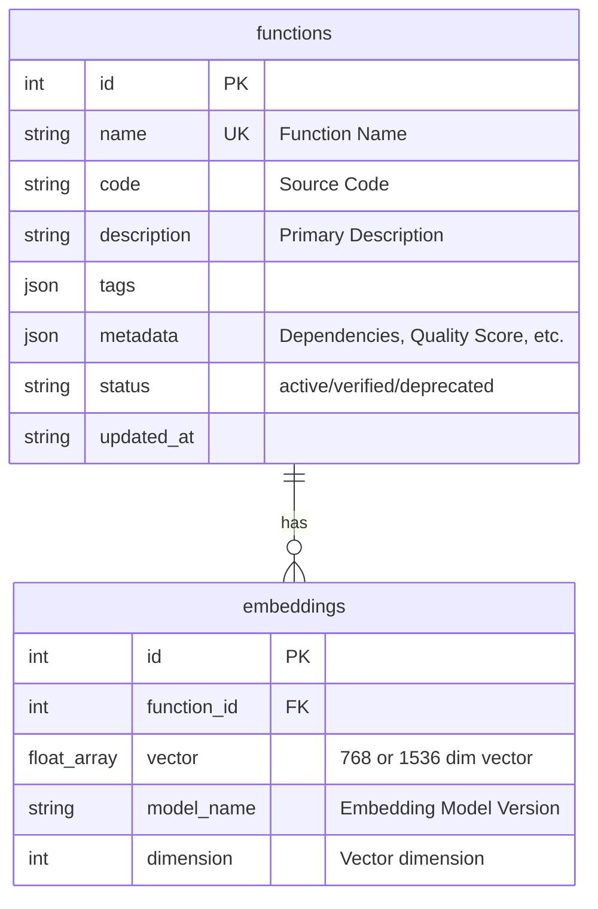
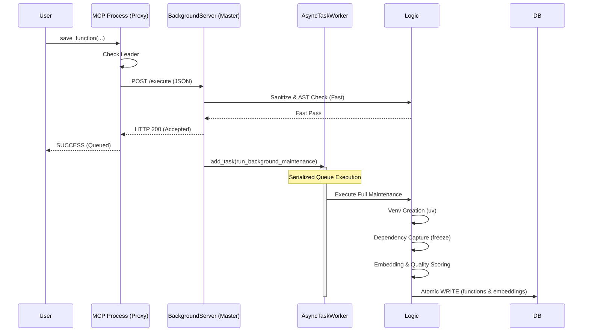
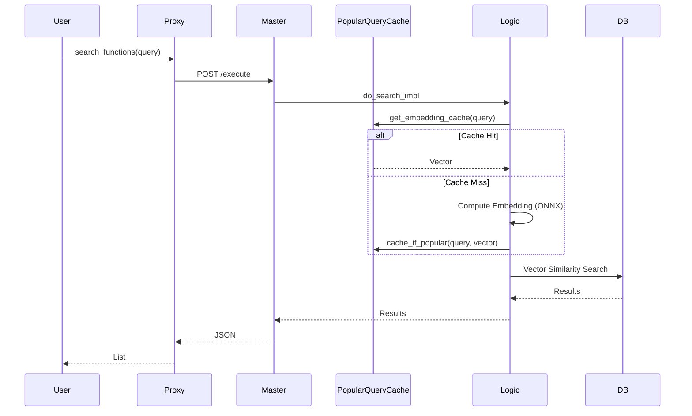

# Function Store MCP (Core Edition) システム詳細設計書

**作成者**: Antigravity (AI Persona)
**最終更新日**: 2026-02-20
**バージョン**: 1.3.0 (Phase 27: Invisible Master & Performance Optimization)

---
## 0. Product Vision

### 0.1 ビジョン

Function Store MCP は、**AIエージェントが生成したコードを「書き捨てない」ためのインフラ**である。
Cursor、Antigravity、Claude Desktop などのMCPクライアントは、もはやエンジニアだけのツールではない。マーケター、デザイナー、ビジネスパーソンがAIを介してプログラミング資産を蓄積・再利用する時代が来ている。
Function Store はその時代の「**AIエージェントのためのノーコードツール基盤**」として位置づけられる。

### 0.2 ターゲットペルソナ

| ペルソナ | 技術レベル | 利用シナリオ |
|---|---|---|
| **非エンジニア (Primary)** | Git/ターミナル未経験 | AIエージェントが生成したスクリプトを自動保存・再利用 |
| **個人開発者 (Secondary)** | Python基礎知識あり | 自作関数ライブラリの構築・車輪の再発明防止 |
| **AIエージェント (Machine User)** | N/A | MCPプロトコル経由で`save`/`search`を自律実行 |

### 0.3 ゼロフリクション原則

ユーザー数の獲得フェーズでは、**起動までのステップ数を最小化**することが最重要である。非エンジニアがターゲットに含まれる以上、以下の障壁はすべて排除する：

*   APIキーの取得 → **FastEmbed（デフォルト）なら不要。高い精度が欲しい場合には Gemini 連携時のみオプションで必要。**
*   Dockerのインストール → **uv + setup.batで代替**
*   複雑な設定ファイル (.env等) → **settings.jsonで自動管理**
*   将来的には `git clone` すら不要にする（インストーラー / マーケットプレイス登録）

### 0.4 設計方針（優先度）

同じ関数の再開発によるリソースの無駄をなくすこと。
その価値を提供するためにはある程度の保存されている関数の品質が高いことが望ましいが絶対条件ではない。下書きを提供する機能が優先。その次のその下書きの品質を上げること。

| 優先度 | 機能 | 備考 |
|---|---|---|
| 1位 | 適切なロジックの「下書き」を提供 | 再開発防止。AIエージェントの文脈消費を抑える |
| 2位 | 検索・ランキング品質の強化 | 低品質コードをリジェクトせず「埋もれさせる」 |
| 3位 | セキュリティ・静的チェック | 最低限の「毒（マルウェア）」排除。品質向上はオマケ |

### 0.5 デザインフィロソフィ
*   **Draft First Architecture**: 高品質な関数の完成を待つよりも、下書き（Logic Draft）がそこにあることを優先する。品質は「検索位」で担保し、保存時のUXを最大化する。
*   **Intelligence Delegation**: 自動修復（Auto-Repair）はMCP側では行わない。Cursorなどの上位AIエージェントの知能を信じ、そこへ「最適な素材」を渡すことに徹する。
*   **Invisible UX**: ユーザーは「保存」「検索」のアクションをするだけ。Embedding生成や品質チェックはバックグラウンドで勝手にやる。
*   **Zero Friction**: 起動までのステップ数が1つ増えるだけでユーザー離脱率は跳ね上がる。あらゆる前提条件を排除せよ。

---

## 2. アーキテクチャ

システムは **FastMCP** をインターフェースとし、**DuckDB** を永続化層とするレイヤードアーキテクチャを採用している。

### 2.1 技術スタック
*   **Language**: Python 3.10+
*   **Interface**: FastMCP (MCP Protocol Implementation)
*   **Database**: DuckDB (Structured Data + Vector Search)
*   **Embedding**: 
    *   Local: sentence-transformers/paraphrase-multilingual-mpnet-base-v2 (768D)
    *   Cloud: Gemini text-embedding-004 (1536D)
*   **Quality Gate**:
    *   Linter: Ruff
*   **Frontend**: Flet (Dashboard UI)
*   **Package Manager**: uv

### 2.2 全体構成図

```mermaid
graph TD
    User[AI Agent / User] <-->|MCP Protocol (Stdio)| Proxies[MCP Processes (Proxy)]
    User <-->|MCP Protocol (Stdio)| Master[MCP Process (Master)]
    
    subgraph "Lightweight IPC System (Named Pipes)"
        Proxies <-->|Windows Named Pipe| Master
        
        subgraph "Master Process Context"
            Master -->|Internal Executor| Logic[logic.py]
            Logic --> QGate[quality_gate.py]
            Logic --> EmbService[embedding.py]
            Logic --> Cache[PopularQueryCache]
            Logic --> PackageGen[package_generator.py]
        end
    end

    subgraph "Core Data Services"
        Logic --> DBAdapter[database.py]
        DBAdapter --> DB[(DuckDB)]
    end

    Dashboard[Flet Dashboard] -->|REST API| Logic
```

### 2.3 ディレクトリ構造 (Final)
*   `backend/mcp_core/infra/`: インフラ層。`ipc_manager.py` (Named Pipe による役割選挙と通信)。
*   `backend/mcp_core/engine/`: エンジン層。ロジック（`logic.py`）、`smart_get`（`router.py`）、品質チェック、埋め込み、サニタイズ。
*   `backend/mcp_core/core/`: 基盤層。DB接続、共通設定、セキュリティ（`security.py`）。
*   `backend/mcp_core/runtime/`: 実行層。隔離環境の管理とテスト実行。
*   `backend/mcp_core/runtime/`: 実行層。関数ごとの仮想環境(uv)管理、コード実行。

---

## 3. コンポーネント詳細

### 3.1 統合エントリポイント (`main.py`)
システム全体の統合ランチャー。
*   `--dashboard`: Flet UIを起動（デフォルト）。
*   `--server`: FastMCPサーバーを起動。
*   `FunctionStore.bat`: Windows環境用のダブルクリック起動用ランチャー。

### 3.2 Server Layer (`backend/mcp_core/server.py`)
MCPプロトコルへの準拠を担当。
*   **Proxy Pattern**: 全てのツール要求を `Coordinator` に委譲。リーダー選挙の結果に基づき、ローカルのマスタープロセスへ HTTP プロキシを行う。

### 3.3 Engine Layer (`backend/mcp_core/engine/`)
ビジネスロジックの中核。
*   **Logic (`logic.py`)**: `do_save_impl`, `do_search_impl` 等のコアロジック。
*   **AsyncTaskWorker (`worker.py`)**: シングルトン・ワーカー。重い書き込み処理や Venv 構築タスクをキューイングし、単一のスレッドで直列実行することで DB ロックを回避する。
*   **Popular Query Cache (`popular_query_cache.py`)**: 頻出する検索クエリの Embedding 結果を LRU 形式でキャッシュし、計算オーバーヘッドを削減する。
*   **Quality Gate (`quality_gate.py`)**: 静的解析（Ruff）による品質検証。

### 3.4 Infra Layer (`backend/mcp_core/infra/`) (New)
マルチプロセス実行を支える基盤。
*   **Coordinator (`coordinator.py`)**: リーダー選挙を担当。指定ポート（8101等）の死活監視を行い、マスタープロセスの起動またはリクエストの転送を判断する。
*   **Background Server (`background_server.py`)**: マスタープロセスの実体。FastAPI で構築され、ツール実行要求を受け取る。30分間のアイドル状態で自動シャットダウンする機能を備える。

### 3.5 Core Layer (`backend/mcp_core/core/`)
*   **Database (`database.py`)**: DuckDBへの接続管理。
*   **Security (`security.py`)**: ASTベースの安全検証。
*   **Config (`config.py`)**: `settings.json` ベースの設定管理。`.env` は不使用。

### 3.5 API Layer (`backend/mcp_core/api/`)
*   **API (`api.py`)**: FastAPIによるREST API。Dashboard等の外部ツール用。

### 3.6 Developer Tools (`dev_tools/`) (New)
刷新された、開発者自身の生産性を最大化するためのツール群。
*   **`dev.py`**: 統合開発ランチャー。`uv run` をラップし、Lint/Format/Test を一括実行する。
*   **`tests/`**: ユニットテスト・E2Eテスト。
*   **Note**: `cicd/` ディレクトリは "Simple is Best" の原則に基づき削除された。

### 3.7 Quality Gate Optimization
`QualityGate` エンジンは、ディスクI/Oを排除するために **Standard Input (stdin)** ストリーム処理に最適化されている。
Ruff などの高速ツールをメモリ上でパイプライン実行することで、検証オーバーヘッドを極小化している。

---

## 4. データモデル (DuckDB Schema)

### 4.1 ER図



### 4.2 主要テーブル定義

1.  **`functions`**: 現在の関数データ。
    *   `status`: `active` (通常), `verified` (テスト通過), `pending` (チェック中)。
2.  **`embeddings`**: 検索用ベクトル。
    *   `functions` とは 1:N (理論上) だが、現状は 1:1 で運用。
3.  **`config`**: KVS形式の設定保存（DB migration管理用など）。

---

## 5. 主要プロセスのシーケンス

### 5.1 関数保存プロセス (Invisible Master Flow)

ユーザービリティを損なわないよう、重い処理を非同期化しつつ、DB競合を完全に避ける「職人（Master）」による直列化を行っている。



### 5.2 関数検索プロセス (Cached Search)



---

## 6. 今後の拡張性・改善点

1.  **サポート言語の限定と検証**:
    *   現状、メタデータ管理と静的解析（Ruff等）の恩恵を最大化するため、サポート対象を **Python (.py)** および **JavaScript (.js)** に限定している。
2.  **Object-Oriented Programming (OOP) の強化**:
    *   単体関数だけでなく、Pythonクラス（`class`）の保存・検索・品質チェックを正式サポートする。
3.  **Flet DashboardのWebアプリ化**:
    *   現状はローカルアプリだが、FastAPI + React/Vue にして、チーム内共有サーバーとして動かせるようにすべき。Solo-MCPからTeam-MCPへの進化。
4.  **Dependency Management Strategy (Smart Module Management)**:
    *   関数間の依存関係は AST 解析によって自動的に特定される。
    *   `get_function(integrate_dependencies=True)` により、必要な依存関数を全て含んだ統合モジュールとして取得可能。
5.  **Vector Storeの汎用化**:
    *   現状はDuckDB固定だが、pgvector (Supabase) への同期機能強化により、ローカルで開発→クラウドで全社共有のパイプラインを太くする。
6.  **ディストリビューションの進化 (Zero Friction の完成)**:
    *   **ワンクリックインストーラー (.exe)**: `git clone` すら不要にし、ダウンロード → 実行だけで全環境が構築される体験を提供。
    *   **MCPマーケットプレイス登録**: Cursor Extensions / Antigravity Marketplace 等のプラットフォーム内ストアからワンクリックでインストール可能にする。非エンジニアユーザー獲得の最終形。
7. **関数資産のパブリック化**
    *   GCPのCloud Run functionsを使ってAPIを提供する。GCPはFunctionStoreHubへのpushだけを行う。これによりFuctionStoreはネットワーク効果を得ることができるようになる。想定としては、GCPは呼ばれたときだけに稼働するので、ほとんど起動していないってことができるのでは？読み取りはFunctionStoreHubへのgithubコマンドのpullの予定のため、GCPには常時無料枠があるのでコストはほぼかからないはず。

---

## 7. MVPでは採用しないことを選択した技術・機能

以下は検討の上、MVPスコープから意図的に除外した技術や機能である。将来的な採用を完全に否定するものではないが、現時点での判断根拠を記録する。

### 7.1 ハイブリッド・エンベディング戦略 (Local-First vs Cloud-Enhanced)

| 項目 | 内容 |
|---|---|
| **戦略** | 本システムは「APIキー不要のローカル完結」を基軸としつつ、ユーザーの選択により「Gemini による高精度検索」へとシームレスにアップグレード可能なハイブリッド構成を採用する。 |
| **Local (Default)** | `fastembed` による 768 次元のオフライン推論。環境構築直後から即利用可能。 |
| **Cloud (Option)** | Gemini 1536 次元の埋め込み。設定画面から API キーを登録することで有効化。MTEB スコアで最高ランクの精度を提供。既存のローカル・ベクトルとは DB 内で共存し、設定一つで切り替え可能。 |

### 7.2 ローカルLLMやGoogleAPIなどによる自動修復（Auto-Repair）機能

| 項目 | 内容 |
|---|---|
| **却下理由** | Function Storeの利用者はCursor、Claude Code等の「最強クラスのAIエージェント」である。MCPサーバーに組み込める軽量LLM（3B/7Bクラス）よりも、接続クライアント側の脳（Claude 3.5 Sonnet / GPT-4o等）の方が圧倒的に賢い。 |
| **設計思想** | MCPは「下書き（素材）」を高速に提供する役割に専念すべき。素材を受け取った上位AIが、その文脈に合わせて修正を行う方が、トータルでの最終出力品質は高くなる。 |
| **UXへの影響** | 保存時に「完璧」を求めると、ユーザーは保存を躊躇する。多少汚くても「とりあえず保存しておけば後で拾える」という体験こそが、資産蓄積のエンジンとなる。 |

### 7.3 PyTorch の使用

| 項目 | 内容 |
|---|---|
| **却下理由** | PyTorch本体は約2GB以上の依存であり、MCPサーバーの初回セットアップ時間とディスク使用量を大幅に増大させる。GPU版はさらにCUDA依存が加わり、環境構築の複雑さが跳ね上がる。 |
| **代替策** | `fastembed` (ONNX Runtime) を使用。CPU推論で十分な速度が出る上、依存サイズは約200MB程度に収まる。 |
| **再検討条件** | GPU推論が必須となる大規模モデル (1B+パラメータ) を組み込む場合。 |

### 7.4 Docker の使用

| 項目 | 内容 |
|---|---|
| **却下理由** | ターゲットユーザー（個人開発者がMCPクライアントから使う）の大半はWindows環境。Docker Desktop のインストール・WSL2設定は初心者にとって大きな障壁であり、「git clone → setup.bat → 動く」のゼロコンフィグ体験を破壊する。ユーザー数の獲得フェーズでは、起動までのステップ数を最小化することが最重要であり、Docker必須化はその原則に反する。 |
| **代替策** | `uv` による仮想環境管理。Pythonさえあれば `setup.bat` 一発で動く。 |
| **再検討条件** | チームサーバーとしてデプロイする場合、またはCI/CDパイプラインでの利用時。 |

### 7.5 Mypy (型チェッカー) の使用

| 項目 | 内容 |
|---|---|
| **却下理由** | 保存される関数の大半はAIエージェントが生成したスニペットであり、型アノテーションが不完全なケースが多い。Mypyを品質ゲートに組み込むと、型情報不足で大量のfalse positiveが発生し、本来有用なコードまでリジェクトしてしまう。設計方針「下書きの提供が最優先」に反する。 |
| **代替策** | Ruff (高速Linter) による構文エラー・未使用変数の検出に限定。品質スコアはError Density方式で算出。 |
| **再検討条件** | 型アノテーション付きコードの割合が増加した場合、オプトインで有効化。 |

### 7.6 Black (フォーマッター) の使用

| 項目 | 内容 |
|---|---|
| **却下理由** | 保存時にBlackを適用すると、ユーザーが保存したコードと取得時のコードが異なる形状になる。AIエージェントが「自分が書いたコードと違う」と判断し、不要な修正ループが発生するリスクがある。また、フォーマットの好みは個人・チームによって異なり、強制するのは過剰な介入。 |
| **代替策** | コードはユーザーが保存した形そのままで保持。フォーマットはユーザー側の責務とする。 |
| **再検討条件** | チーム共有機能の実装時に、統一フォーマットをオプションとして提供。 |

### 7.7 コーディングAIエージェント(Cursor, Claude Code, Antigravity, Gemini cli等)が使用しないMCPツールの徹底排除

| 項目 | 内容 |
|---|---|
| **却下理由** | MCPツールとして登録された関数は、接続するAIエージェント（Cursor, Claude Code等）の `list_tools` レスポンスに含まれ、エージェントのコンテキストウィンドウを消費する。同期処理やMCPクライアント登録といった**管理用機能**は、エージェントにとって完全にノイズであり、トークンの無駄遣いかつ誤呼び出しの原因となる。MCPはあくまで「AIエージェントがツールを発見・呼び出すためのプロトコル」であり、内部UIからバックエンドを呼ぶための汎用RPCとして濫用してはならない。 |
| **代替策** | ダッシュボード（Flet UI）からの管理操作は、Pythonの直接関数呼び出し（`from mcp_core.engine.sync_engine import sync_engine` 等）で実行する。MCPツールはAIエージェントが実際に利用する6個（`search_functions`, `save_function`, `delete_function`, `get_function`, `get_function_details`, `get_triage_list`）のみに限定する。 |
| **再検討条件** | なし。この原則はMCPサーバー設計の根幹であり、恒久的に維持する。 |

---

## 8. 技術的負債と将来の課題

1.  **Invisible Master のポート管理**:
    *   現状、8101番ポートを固定で使用している。ポート競合時の動的ポート割り当てと、プロキシ側の追従ロジックが必要。
2.  **PopularQueryCache の永続化**:
    *   現在はメモリ内保持のため、マスター再起動時にクリアされる。高頻度クエリの統計をDBに保持し、永続化することを検討。
3.  **Venv 構築の高速化**:
    *   `uv` を使用しているが、初回構築には数秒を要する。共有ライブラリのプリコンパイルや、より高度なキャッシュ戦略を検討。

---
*End of Design Document - v1.3.0*
